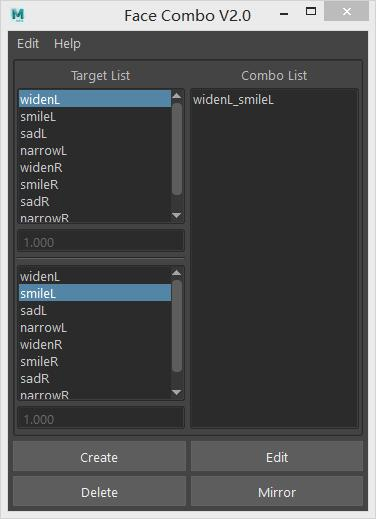

# faceCombo 
##### Maya 表情联合修型工具



##
### 说明
这个工具是为了处理 Maya 绑定中的“表情联合修型”（Face Combo）。
它可以快速创建和编辑修型目标体，也支持删除和左右镜像。欢迎使用测试;)

### 演示
1. [Bilibili](https://www.bilibili.com/video/av25522772) 地址
2. [Vimeo](https://vimeo.com/251473725) 地址

### 版本
支持 Windows 64位下 Maya 2016和2018版本，其他 Maya 版本没有测试。

### 安装
1. 下载最新版本并解压缩文件包；
2. 复制文件 faceCombo.pyd 到 Maya可识别的 Python 路径文件夹下；

   （默认路径：“C:\Users\UserName\Documents\maya\2016\scripts”）

### 使用
```python
import faceCombo
faceCombo.main()  
```